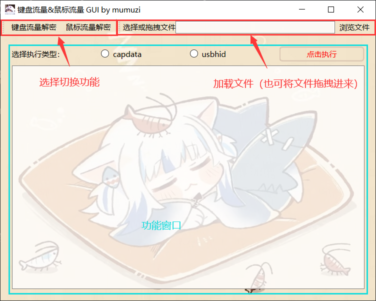
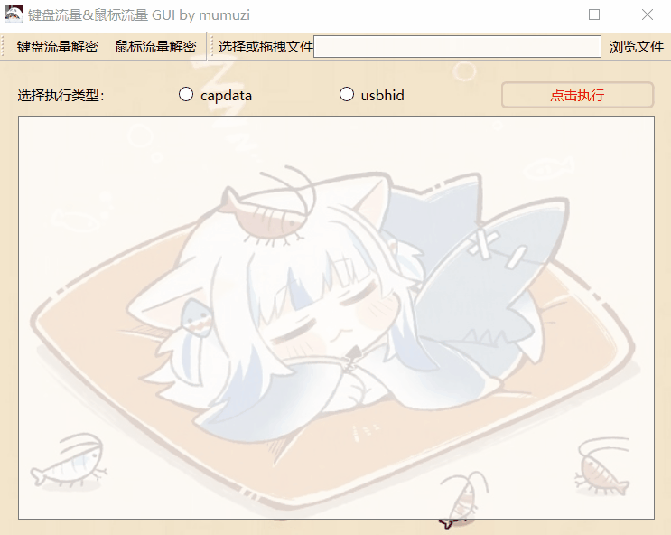

# UsbKeyboard&Mouse_Hacker_Gui

> 本工具作用为对CTF中常见的键盘流量与鼠标流量进行解密，采用GUI的形式方便使用

> 注意：tshark.exe必须要添加在环境变量中，否则无法使用


————————————————————————————————————————————————
2023/10/18 更新

支持部分蓝牙键盘流量


2023/07/11 更新

1.鼠标流量添加一键梭图，并保存至运行目录下的`output_files`文件夹中

2.将MouseDecrypt.py中的变量`type`修改为`_type`

3.将run_GUI.py中的`app.exec_()`修改为`app.exec()`
————————————————————————————————————————————————

## 使用帮助

**首先要将tshark.exe所在的文件夹添加到环境变量path下，例如作者tshark.exe在D:\\wireshark下，需要打开环境变量--Path--新建--D:\\wireshark\\**

使用python3执行run_GUI.py加载

```shell
python3 run_GUI.py
```


> Note:需安装PySide6、numpy、matplotlib库
> 若未换源可使用　`pip install -r requirements.txt -i  https://pypi.tuna.tsinghua.edu.cn/simple执行`



> 该工具并不能保证百分百能够提取出想要的内容，如果不符合常见规则可能提取结果为空。


### 键盘流量

加载文件后，选择执行类型后点击执行即可

若知道类型，可以直接选择，~~若不知道类型，反正就两种都试一下就行了~~




### 鼠标流量

与键盘一样，加载文件后，选择执行类型后点击执行即可。

建议先选择`所有`，确定是否有输出后，再按照鼠标按键进行分类查看。


